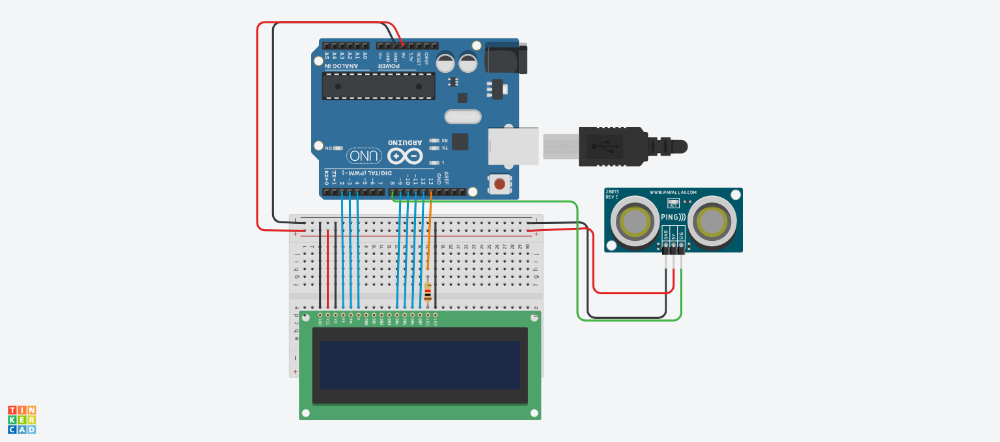

#Projeto de Tela LCD com sensor de Distancia

este projeto foi desenvolvido dentro do Tinkercard, na disciplina de Internet das Coisas (IOT),
para a criação de um prototipo com arduino que simule uma mensagem de Mantenha
distancia toda vez que alguém se aproxime a menos de 1 metro do sensor.

## Componentes Usados
- 1 Arduino Uno
- 1 Placa de Ensaio
- 1 sensor de Distancia
- 1 Tela LCD 16x2
- 14 Jumper Macho-Macho
- 3 Jumper Macho-Femea
- 1 Resistor de 1 kOhms

 ## Montagem do Circuito
 

## Explicação do Código

Importando a biblioteca do LCD.
#include <LiquidCrystal.h>
 biblioteca do LCD
#include <LiqidCrystal.h>
 criar variavel do lcd
LiqidCrystal lcd (2,3,4,9,10,11,12);
int lcdlcd =13;

metodo para capturar a distancia eretomar o valor para o arduino.
retornar numero quebrado longo
long distancia(int trigger, int echo);
triguer porta de saida ;
pinMode(trigger
 echo porta de entrada

void setup()
{
 pinMode(ledlcd, OUTPUT);  DEFINIR LEDLCD SAIDA
 digitalWrite(ledLcd, HIGH); ligar os LEDs do LCD
 lcd.begin(16,2);  informar que o lcd tem 16 colunas e 2 linhas
 lcd.clear();  iniciar o lcd limpo
  
}

void loop()
{
 lcd.setCursor(0,0);  iniciar a escrita na linha 0 coluna 0
 lcd.print("Ola Mundo");
 lcd.setCursor(0,1); iniciar a escrita na linha 0 coluna 0
 lcd.print("Bom Dia!"); 
}
